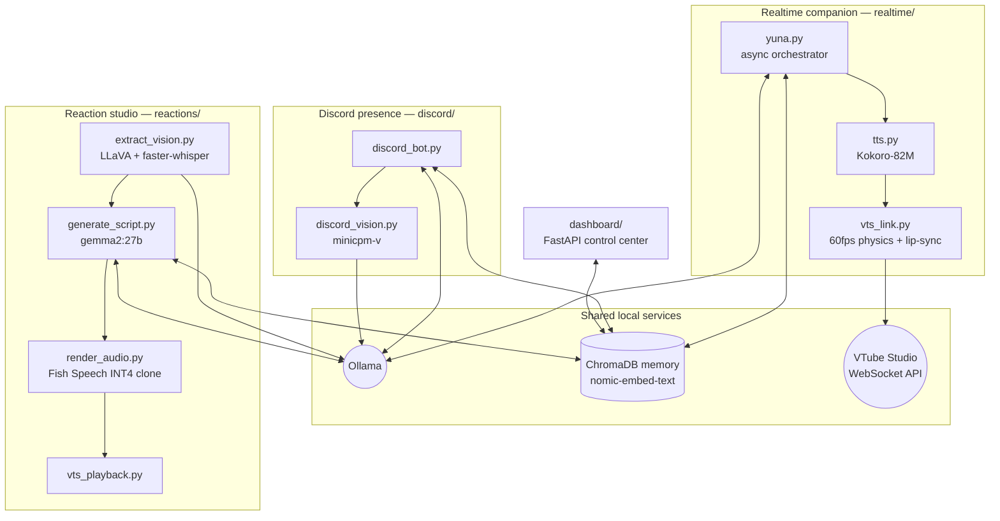

# Yuna AI — Local AI VTuber Pipeline

> A fully local, GPU-budget-aware AI VTuber: realtime voiced chat with an animated Live2D avatar, an offline video-reaction studio, a Discord presence, and a web control center — all running on a single 12 GB consumer GPU with zero cloud APIs.


-black)


Yuna is a character-driven AI VTuber. She chats in real time with a synthesized voice and a live-animated avatar, watches and reacts to videos, hangs out in Discord servers, and remembers facts about the people she talks to across sessions. Every model in the stack — chat LLM, vision LLM, speech-to-text, text-to-speech, and embeddings — runs locally.

The interesting engineering problem: doing *all of that at once* on one RTX 3060. The project solves it with pipeline staging, explicit VRAM orchestration between models, and a custom 4-bit quantization fork of Fish Speech.

---

## Highlights

- **Procedural avatar animation engine** — a 60 fps asyncio physics loop drives VTube Studio over WebSocket with layered breathing sway, randomized blinks, smoothly-lerped eye saccades, micro head impulses, and emotion states, so the avatar never looks frozen even when idle. ([realtime/vts_link.py](realtime/vts_link.py))
- **Audio-reactive lip-sync** — TTS output is analyzed chunk-by-chunk (RMS at ~30 Hz, wall-clock synced to playback) and fed into the avatar's mouth and body-bounce parameters in real time. ([realtime/tts.py](realtime/tts.py))
- **Emotion tag protocol** — the LLM is prompted to emit inline tags like `[flustered]` or `[smug]`; the pipeline parses them to switch avatar expressions mid-sentence *and* modulate TTS speaking rate per segment (sad = 0.85×, panicked = 1.25×).
- **Self-updating long-term memory** — every user message is passed to a background LLM "fact extractor" that emits `[FACT]` / `[UPDATE]` / `[FORGET]` operations against a ChromaDB vector store, with near-duplicate detection and distance-thresholded recall. ([memory.py](memory.py))
- **Multimodal video understanding** — videos are decomposed into an interleaved, timestamped timeline of LLaVA frame descriptions and faster-whisper speech segments, with audio context and previous-frame context injected into each vision call for consistency. ([reactions/vision.py](reactions/vision.py))
- **Custom INT4 TTS server** — a fork of Fish Speech adding bitsandbytes NF4 4-bit quantization, OpenAI-compatible `/v1` endpoints, Kokoro-style text normalization, lazy model loading and idle unloading — so a voice-cloning TTS model fits alongside everything else on 12 GB.
- **VRAM orchestration** — the reaction pipeline runs vision, scriptwriting, and TTS as separate stages and explicitly evicts models from VRAM between them. ([reactions/run_all.py](reactions/run_all.py))
- **Memory trust model on Discord** — a global "authoritative" fact partition writable only by the bot owner, per-user "subjective" partitions for everyone else, and an impersonation guard for users who rename themselves to the owner's name. ([discord/discord_bot.py](discord/discord_bot.py))

---

## Architecture

Four entry-point pipelines share three local services (Ollama, ChromaDB memory, VTube Studio):



### 1. Realtime companion (`realtime/`)

The core loop: type to Yuna, she answers in voice with a live avatar.

- **`yuna.py`** — non-blocking asyncio orchestrator. Streams tokens from Ollama for low perceived latency, injects recalled memories into the prompt, spawns fire-and-forget memory-extraction tasks, and triggers the first avatar expression before TTS even starts so the face reacts instantly.
- **`tts.py`** — splits responses on emotion tags, pre-renders *all* Kokoro-82M audio segments before playback (no mid-sentence gaps), then plays them while swapping expressions between segments and streaming RMS volume to the avatar.
- **`vts_link.py`** — the animation engine. Emotion tags map to Live2D parameter blueprints (30 emotions) that are lerped toward each frame; idle life (blinks, saccades, sway, impulses) is layered underneath, and a per-emotion physics speed makes her visibly calmer when sad and jittery when excited.
- **`studio.py`** — manual puppeteering console: paste any tagged script and Yuna performs it (useful for testing and produced content).

```bash
cd realtime
python yuna.py --tts --studio        # voice + avatar
python yuna.py --test --tts --studio # canned emotion showcase
python studio.py                     # manual performance mode
```

### 2. Reaction studio (`reactions/`)

An offline content pipeline: drop in a video, get back Yuna watching and reacting to it.

| Stage | Script | Models | What it does |
|---|---|---|---|
| 1. Perceive | `extract_vision.py` | LLaVA 13B + faster-whisper | Samples frames every 2 s, transcribes audio, builds a timestamped visual+speech timeline; filters out "nothing notable" frames |
| 2. Write | `generate_script.py` | gemma2:27b | Writes an in-character reaction script from the timeline, seeded with recalled memories/inside jokes |
| 3. Voice | `render_audio.py` | Fish Speech S2-pro (NF4) | Renders each line with a cloned reference voice via the local OpenAI-compatible TTS API |
| 4. Perform | `vts_playback.py` | — | Plays the rendered lines back in sequence for recording |

`run_all.py` chains all four stages and **flushes models from VRAM between stages** — the 27B scriptwriter and the vision model never need to coexist in memory:

```bash
cd reactions
./start_server.sh                    # boot the INT4 Fish Speech server (port 8880)
python run_all.py my_video.mp4       # video must be in reference_videos/
python generate_text_script.py "topic"  # or react to a text prompt instead
```

### 3. Discord presence (`discord/`)

Yuna as a server member: mention her and she replies in character, with per-channel conversation history guarded by per-channel asyncio locks.

- Understands images, GIFs, and Tenor links — attachments and linked media are resolved, normalized to JPEG, and described by minicpm-v before being handed to the chat model.
- Two-tier memory: facts from the owner go to the **global** partition ("always true"); facts from other users go to **personal** partitions ("subjective, may be fake"), and the prompt instructs the model to side with global facts on conflict.
- Can deliberately leave people on read (`[IGNORE]` protocol) instead of being compulsively chatty.

```bash
python discord/discord_bot.py        # needs DISCORD_TOKEN in .env
```

### 4. Web control center (`dashboard/`)

A FastAPI + vanilla JS dashboard for operating Yuna's brain: browse/search/add/delete vector memories by user partition, and edit the persona prompt from the browser.

```bash
python dashboard/server.py           # http://localhost:8000
```

### Shared: memory system (`memory.py`)

ChromaDB with local `nomic-embed-text` embeddings. Facts are written by LLM extractors (never raw chat), deduplicated by embedding distance before insert, recalled with a strict relevance threshold so generic messages don't dredge up random facts, and updated/deleted via nearest-match lookup.

### Custom Fish Speech INT4 fork (`fish-speech-int4-patch/`, vendored)

To fit a voice-cloning TTS model on the same 12 GB card as the LLMs, this project maintains a patched Fish Speech server:

- bitsandbytes **NF4 4-bit quantization** for the S2-pro checkpoint, with export/reload of quantized weights
- **OpenAI-compatible** `/v1/audio/speech` API (+ voice registration, model discovery), so it drops into any OpenAI-style client
- Kokoro-inspired **text normalization**, streaming/buffering fixes, Spanish autodetection
- **Lazy loading + idle timeout** so the TTS model unloads itself when the pipeline doesn't need it
- RTF benchmarks and TTS→ASR round-trip correlation reports to validate that quantization didn't hurt intelligibility

---

## Model stack

Everything is served locally through Ollama or the patched Fish Speech server.

| Role | Model | Notes |
|---|---|---|
| Realtime chat | qwen2.5:14b | streamed token-by-token |
| Reaction scriptwriting | gemma2:27b | offline stage, quality over latency |
| Video frame analysis | llava:13b | audio + previous-frame context injected |
| Discord image vision | minicpm-v | lightweight, always-on |
| Speech-to-text | faster-whisper (medium) | CUDA with automatic CPU fallback |
| Embeddings | nomic-embed-text | powers ChromaDB memory |
| Realtime TTS | Kokoro-82M | fast enough for conversation |
| Studio TTS (voice clone) | Fish Speech S2-pro | custom NF4 INT4 build |

**Reference hardware:** one NVIDIA RTX 3060 (12 GB) on Arch Linux. The pipeline design — staged execution, model eviction, 4-bit TTS — exists specifically to make this work on a mid-range card.

---

## Getting started

**Prerequisites:** Linux (Arch tested), Python 3.10+, [Ollama](https://ollama.com), ffmpeg (for `ffplay` playback and audio extraction), an NVIDIA GPU with CUDA (12 GB recommended), and [VTube Studio](https://denchisoft.com/) with its API enabled (for avatar features).

```bash
git clone https://github.com/MasHasNoLife/yuna-ai.git
cd yuna-ai

python -m venv .venv && source .venv/bin/activate
pip install -r requirements.txt

# Pull the local models you plan to use
ollama pull qwen2.5:14b
ollama pull nomic-embed-text
ollama pull llava:13b        # reactions pipeline
ollama pull gemma2:27b       # reactions pipeline
ollama pull minicpm-v        # discord vision

# Persona (the real prompt is private — start from the example)
cp realtime/yuna_prompt.py.example yuna_prompt.py

# Discord credentials (optional, only for the bot)
cp .env.example .env

cd realtime
python yuna.py --tts --studio
```

On the first `--studio` run, click **Allow** in the VTube Studio API popup; the auth token is cached in `realtime/vts_token.txt`.

> **Note:** `yuna_prompt.py` (the full persona), memory databases, and voice reference audio are intentionally untracked — the repo ships the machinery, not the character.

---

## Roadmap

- Live chat ingestion (Twitch/YouTube) feeding the realtime loop
- Lip-synced avatar playback during reaction videos (stage 4 currently plays audio only)
- Centralized config for model names/endpoints
- Dashboard: live pipeline status and service health checks

## Acknowledgements

Built on the shoulders of [Ollama](https://ollama.com), [Fish Speech](https://github.com/fishaudio/fish-speech), [Kokoro-82M](https://huggingface.co/hexgrad/Kokoro-82M), [faster-whisper](https://github.com/SYSTRAN/faster-whisper), [ChromaDB](https://www.trychroma.com/), [pyvts](https://github.com/Genteki/pyvts), and [VTube Studio](https://denchisoft.com/).
