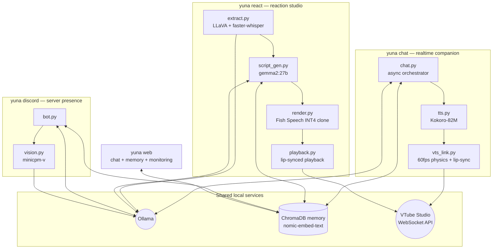

# Yuna AI — Local AI VTuber Pipeline

> A fully local, GPU-budget-aware AI VTuber: realtime voiced chat with an animated Live2D avatar, an offline video-reaction studio, a Discord presence, and a web control center — all running on a single 12 GB consumer GPU with zero cloud APIs.


-black)


Yuna is a character-driven AI VTuber. She chats in real time with a synthesized voice and a live-animated avatar, watches and reacts to videos, hangs out in Discord servers, and remembers facts about the people she talks to across sessions. Every model in the stack — chat LLM, vision LLM, speech-to-text, text-to-speech, and embeddings — runs locally.

The interesting engineering problem: doing *all of that at once* on one RTX 3060. The project solves it with pipeline staging, explicit VRAM orchestration between models, and a custom 4-bit quantization fork of Fish Speech.

---

## Highlights

- **Procedural avatar animation engine** — a 60 fps asyncio physics loop drives VTube Studio over WebSocket with layered breathing sway, randomized blinks, smoothly-lerped eye saccades, micro head impulses, and emotion states, so the avatar never looks frozen even when idle. Auto-reconnects if the websocket drops. ([vts_link.py](src/yuna/realtime/vts_link.py))
- **Audio-reactive lip-sync** — TTS output is analyzed chunk-by-chunk (RMS at ~30 Hz, wall-clock synced to playback) and fed into the avatar's mouth and body-bounce parameters in real time. ([tts.py](src/yuna/realtime/tts.py))
- **Emotion tag protocol** — the LLM emits inline tags like `[flustered]` or `[smug]`; the pipeline parses them to switch avatar expressions mid-sentence *and* modulate TTS speaking rate per segment (sad = 0.85×, panicked = 1.25×). ([tags.py](src/yuna/realtime/tags.py), [emotions.py](src/yuna/realtime/emotions.py))
- **Self-updating long-term memory** — every user message is passed to a background LLM "fact extractor" that emits `[FACT]` / `[UPDATE]` / `[FORGET]` operations against a ChromaDB vector store, with near-duplicate detection and distance-thresholded recall. ([fact_extractor.py](src/yuna/core/fact_extractor.py), [memory.py](src/yuna/core/memory.py))
- **Multimodal video understanding** — videos are decomposed into an interleaved, timestamped timeline of LLaVA frame descriptions and faster-whisper speech segments, with audio context and previous-frame context injected into each vision call for consistency. ([vision.py](src/yuna/reactions/vision.py))
- **Custom INT4 TTS server** — a fork of Fish Speech adding bitsandbytes NF4 4-bit quantization, OpenAI-compatible `/v1` endpoints, Kokoro-style text normalization, lazy model loading and idle unloading — so a voice-cloning TTS model fits alongside everything else on 12 GB.
- **VRAM orchestration** — the reaction pipeline runs vision, scriptwriting, and TTS as separate stages and explicitly evicts models from VRAM between them. ([pipeline.py](src/yuna/reactions/pipeline.py))
- **Memory trust model on Discord** — a global "authoritative" fact partition writable only by the bot owner, per-user "subjective" partitions for everyone else, and an impersonation guard for users who rename themselves to the owner's name. ([bot.py](src/yuna/discord_bot/bot.py))

---

## Architecture

Four entry-point pipelines share three local services (Ollama, ChromaDB memory, VTube Studio):



### 1. Realtime companion — `yuna chat`

The core loop: talk to Yuna, she answers in voice with a live avatar.

- **[chat.py](src/yuna/realtime/chat.py)** — non-blocking asyncio orchestrator. Streams tokens from Ollama for low perceived latency, injects recalled memories into the prompt, spawns background memory-extraction tasks (drained gracefully on shutdown), and triggers the first avatar expression before TTS even starts.
- **[tts.py](src/yuna/realtime/tts.py)** — splits responses on emotion tags, pre-renders *all* Kokoro-82M audio segments before playback (no mid-sentence gaps), then plays them while swapping expressions between segments and streaming RMS volume to the avatar.
- **[vts_link.py](src/yuna/realtime/vts_link.py)** — the animation engine. Emotion tags map to Live2D parameter blueprints (30 emotions) lerped toward each frame; idle life (blinks, saccades, sway, impulses) is layered underneath, and a per-emotion physics speed makes her visibly calmer when sad and jittery when excited.

```bash
yuna chat --tts --studio          # voice + avatar
yuna chat --test --tts --studio   # canned emotion showcase
yuna studio                       # manual puppeteering: paste a script, Yuna performs it
yuna tts "Hello world"            # standalone TTS
```

### 2. Reaction studio — `yuna react`

An offline content pipeline: drop in a video, get back Yuna watching and reacting to it.

| Stage | Module | Models | What it does |
|---|---|---|---|
| 1. Perceive | [extract.py](src/yuna/reactions/extract.py) | LLaVA 13B + faster-whisper | Samples frames every 2 s, transcribes audio, builds a timestamped visual+speech timeline |
| 2. Write | [script_gen.py](src/yuna/reactions/script_gen.py) | gemma2:27b | Writes an in-character reaction script, seeded with recalled memories |
| 3. Voice | [render.py](src/yuna/reactions/render.py) | Fish Speech S2-pro (NF4) | Renders each line with a cloned reference voice via the local OpenAI-compatible TTS API |
| 4. Perform | [playback.py](src/yuna/reactions/playback.py) | — | Plays the lines back with live avatar lip-sync (`--studio`) |

The orchestrator runs stages as separate processes and **flushes models from VRAM between them** — the 27B scriptwriter and the vision model never need to coexist in memory:

```bash
scripts/start_fish_server.sh      # boot the INT4 Fish Speech server (port 8880)
yuna react my_video.mp4 --studio  # video from data/reactions/reference_videos/
yuna react-text "some topic"      # react to a text prompt instead
```

### 3. Discord presence — `yuna discord`

Yuna as a server member: mention her and she replies in character, with per-channel history guarded by per-channel asyncio locks.

- Understands images, GIFs, and Tenor links — resolved, normalized to JPEG, and described by minicpm-v before being handed to the chat model.
- Two-tier memory: facts from the owner go to the **global** partition ("always true"); facts from other users go to **personal** partitions ("subjective, may be fake"), and the prompt instructs the model to side with global facts on conflict.
- Can deliberately leave people on read (`[IGNORE]` protocol) instead of being compulsively chatty.

### 4. Web interface — `yuna web`

A FastAPI + vanilla JS single-page app that brings the whole system together in the browser:

- **Streaming chat** over WebSocket with live emotion chips, recalled-memory footnotes, and push-to-talk voice input (faster-whisper on CPU, so it never competes with the LLM for VRAM).
- **Real-time voice replies** — TTS audio streams to the browser as raw PCM frames and plays through the Web Audio API with a live waveform visualizer.
- **Pluggable backends, switchable live:** LLM local (Ollama) or API (Google AI, with Gemma "thought" parts filtered into the monitoring feed instead of Yuna's mouth); voice local (Kokoro), API (Fish Audio cloud), or the local INT4 Fish Speech server.
- **Memory panel** — a live feed of FACT/UPDATE/FORGET operations as background extraction happens, plus browse/filter/add/delete over the vector store.
- **System tab** — per-turn metrics (TTFT, tok/s, time-to-first-audio, recall latency), session counters, `yuna doctor` health checks, and the model's hidden reasoning for the last turn. The same metrics also go to the terminal and `data/logs/events.jsonl`.

Binds to localhost; set `YUNA_DASHBOARD_TOKEN` for token auth. (`yuna dashboard` is an alias.)

### Custom Fish Speech INT4 fork (`fish-speech-int4-patch/`, vendored)

To fit a voice-cloning TTS model on the same 12 GB card as the LLMs, this project maintains a patched Fish Speech server: bitsandbytes **NF4 4-bit quantization** with export/reload of quantized checkpoints, **OpenAI-compatible** `/v1/audio/speech` endpoints, Kokoro-inspired text normalization, lazy loading + idle timeout, and RTF/ASR-correlation benchmark reports validating that quantization didn't hurt intelligibility.

---

## Model stack

Everything is served locally through Ollama or the patched Fish Speech server, configured in [config.yaml](config.yaml).

| Role | Model (default) | Notes |
|---|---|---|
| Realtime chat | qwen2.5:14b | streamed token-by-token |
| Reaction scriptwriting | gemma2:27b | offline stage, quality over latency |
| Video frame analysis | llava:13b | audio + previous-frame context injected |
| Discord image vision | minicpm-v | lightweight, always-on |
| Speech-to-text | faster-whisper (medium) | CUDA with automatic CPU fallback |
| Embeddings | nomic-embed-text | powers ChromaDB memory |
| Realtime TTS | Kokoro-82M | fast enough for conversation |
| Studio TTS (voice clone) | Fish Speech S2-pro | custom NF4 INT4 build |

**Reference hardware:** a single 12 GB NVIDIA card on Arch Linux (developed on an RTX 3060, currently an RTX 4070). The pipeline design — staged execution, model eviction, 4-bit TTS — exists specifically to make this work on a mid-range card.

---

## Getting started

**Prerequisites:** Linux (Arch tested), Python 3.10+, [Ollama](https://ollama.com), ffmpeg, an NVIDIA GPU with CUDA (12 GB recommended), and [VTube Studio](https://denchisoft.com/) with its API enabled (for avatar features).

```bash
git clone https://github.com/MasHasNoLife/yuna-ai.git
cd yuna-ai

python -m venv .venv && source .venv/bin/activate
pip install -e .

# Pull the local models you plan to use
ollama pull qwen2.5:14b && ollama pull nomic-embed-text
ollama pull llava:13b && ollama pull gemma2:27b   # reactions pipeline
ollama pull minicpm-v                             # discord vision

# Persona (the real one is private — start from the example)
cp -r persona.example persona

# Secrets (only needed for the Discord bot / dashboard auth)
cp .env.example .env

yuna doctor   # verifies every dependency and service, with fix hints
yuna chat --tts --studio
```

On the first `--studio` run, click **Allow** in the VTube Studio API popup; the auth token is cached in `data/vts_token.txt`.

> **Note:** `persona/`, `data/` (memory databases, outputs), and voice reference audio are intentionally untracked — the repo ships the machinery, not the character. Voice cloning requires references you have the right to use (your own recordings, or open corpora like VCTK); configure them in `voice_reference/voices.json`.

## Repository layout

```
src/yuna/
  core/        config, logging, LLM backends, chat engine, memory store, fact extractor, metrics, persona
  realtime/    chat loop, Kokoro TTS, VTS animation engine, emotion blueprints
  reactions/   4-stage video reaction pipeline (+ VRAM orchestration)
  discord_bot/ Discord presence with vision and tiered memory
  tts/         pluggable TTS backends (Kokoro local, Fish cloud, Fish INT4 local)
  web/         web interface: websocket chat server, STT, static frontend
  cli.py       the `yuna` command
  doctor.py    preflight diagnostics
tests/         unit tests for the pure logic (run without GPU/services)
persona.example/  starting-point persona (copy to persona/)
config.yaml    models, endpoints, thresholds, paths
scripts/       Fish Speech launchers, VTS diagnostics
```

## Research paper

The agentic memory system in this repo is the artifact behind a paper on
long-term memory for local LLMs, *Memory That Doesn't Expire*. The paper source
lives in a companion repository:
**[memory-that-doesnt-expire](https://github.com/MasHasNoLife/memory-that-doesnt-expire)**.

The benchmark that produces every number in the paper is here, under
`src/yuna/bench/` and `scripts/robustness_ci.py`, and drives the same memory code
the live app uses. Step-by-step instructions to regenerate every table and figure
are in the paper repo's `REPRODUCE.md` (its commands run against this repo).

## Roadmap

See [ROADMAP.md](ROADMAP.md). Next up: streaming sentence-level TTS, live chat ingestion, and a memory consolidation pass (merging near-duplicate memories and materialising facts implied across several stored items).

## Acknowledgements

Built on the shoulders of [Ollama](https://ollama.com), [Fish Speech](https://github.com/fishaudio/fish-speech), [Kokoro-82M](https://huggingface.co/hexgrad/Kokoro-82M), [faster-whisper](https://github.com/SYSTRAN/faster-whisper), [ChromaDB](https://www.trychroma.com/), [pyvts](https://github.com/Genteki/pyvts), and [VTube Studio](https://denchisoft.com/).
